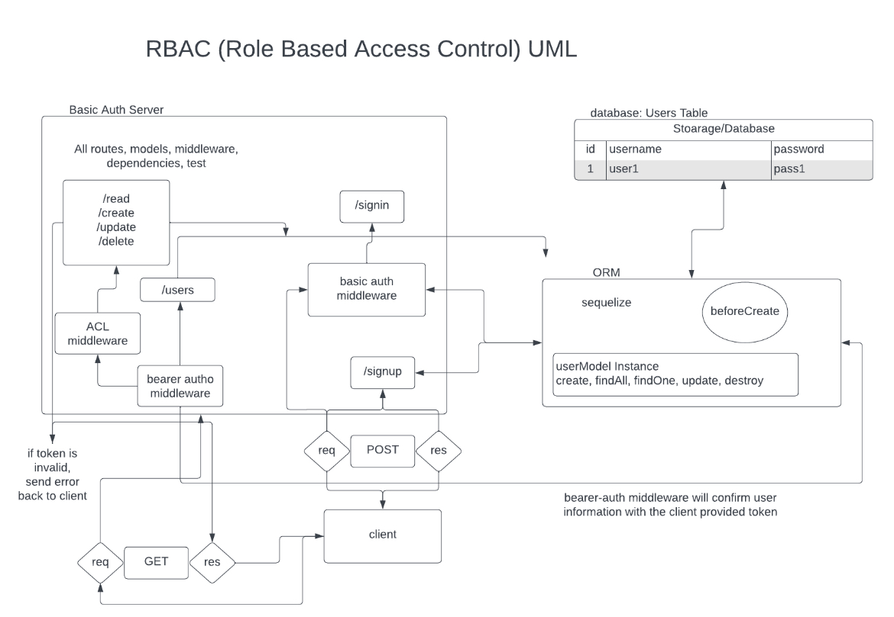

# Project: Auth-Api

## Author: Hayden Cooper

## Problem Domain

Authentication Server Phase 3: Role Based Access Control

Being able to login is great. But controlling access at a more granular level is vital to creating a scalable system. In this lab, you will implement Role Based Access Control (RBAC) using an Access Control List (ACL), allowing to not only restrict access to routes for valid users, but also based on the individual permissions we give each user.

Over the course of the previous 2 modules, you have separately created an auth-server and an api-server … In this lab, you will be integrating those 2 servers to create a single, authenticated API server.

## Links and Resources

- [GitHub Actions ci/cd](https://github.com/Hcooper23/auth-api/actions)
- [back-end dev server url](https://auth-api-aogn.onrender.com/)

## Collaborators

Reece Renninger
Coriana Williams 
Kao Saelor
Ryan Gallaway

## Setup ///

## `.env` requirements (where applicable)

node version "v19.6.1"

## How to initialize/run your application (where applicable)

clone repo, `npm i`, then run `nodemon` in the terminal

## Routes

- Npm Test and install npm Jest if no test runs

## Tests

to run tests, after running `npm i`, run the command `npm test`

## UML

